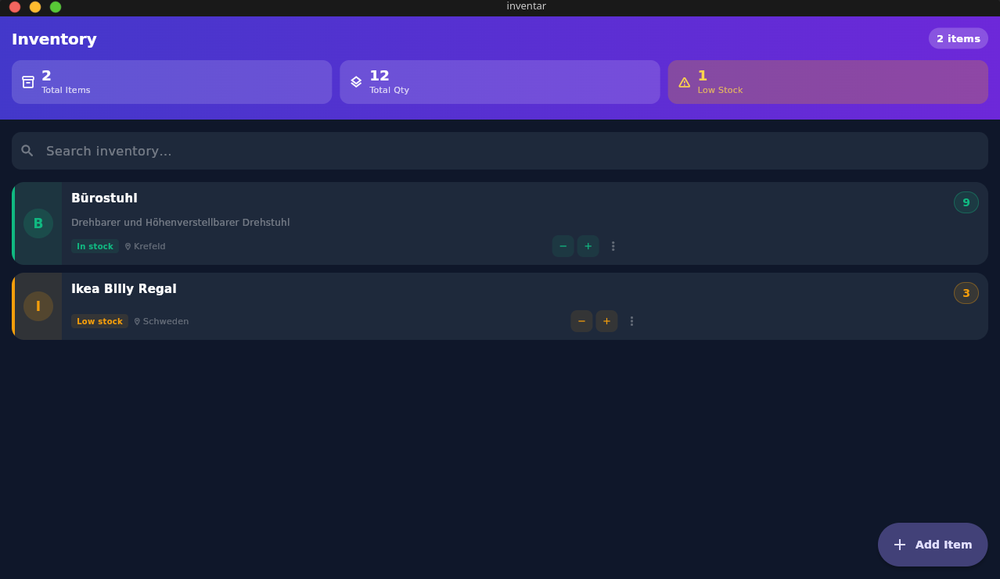

# Inventar

A cross-platform inventory management app built with Flutter.
Track items, quantities, and locations — all data stored locally on-device.



---

## Features

- **Add, edit, and delete** inventory items
- **Quantity stepper** — increment/decrement directly from the list
- **Location tagging** — store where an item is kept
- **Live search** — filter items by name or description
- **Stock status** — automatic In Stock / Low Stock / Out of Stock labels (≤ 5 = low)
- **Summary stats** — total items, total quantity, out-of-stock and low-stock counters
- **Persistent storage** — items survive app restarts via `shared_preferences`
- **Material 3** theming with full light/dark mode support

## Supported Platforms

| Platform | Status |
|---|---|
| Android | Supported |
| Linux desktop | Supported |
| macOS desktop | Supported (requires Xcode) |
| iOS | Supported (requires Xcode) |
| Windows desktop | Supported |

---

## Quick Start with Nix

The repository ships a `flake.nix` that provides a reproducible development shell with Flutter, the Android SDK, and all required native libraries. This is the recommended way to work on the project.

**Prerequisites:** Nix with flakes enabled.
Add the following to `/etc/nix/nix.conf` or `~/.config/nix/nix.conf` if you haven't already:

```
experimental-features = nix-flakes nix-command
```

### Enter the development shell

```sh
nix develop
```

This drops you into a shell with:
- `flutter` (latest from nixpkgs-unstable)
- `jdk21_headless`
- Android SDK (API levels 35 & 36, NDK 28, build-tools 35)
- CMake, Ninja, Clang, pkg-config
- GTK3, OpenGL and Vulkan loaders (Linux only)

All environment variables (`ANDROID_HOME`, `ANDROID_SDK_ROOT`, `JAVA_HOME`, `LD_LIBRARY_PATH`) are set automatically.

### First-time setup

Inside the dev shell, fetch Flutter and Dart package dependencies:

```sh
flutter pub get
```

Accept Android SDK licenses (required once):

```sh
flutter doctor --android-licenses
```

Verify your setup:

```sh
flutter doctor
```

---

## Running the App

### Linux desktop

```sh
nix develop
flutter run -d linux
```

### Android (physical device or emulator)

Connect a device with USB debugging enabled, or start an AVD from Android Studio, then:

```sh
nix develop
flutter run -d android
```

List available devices:

```sh
flutter devices
```

### macOS desktop

> macOS builds require Xcode installed via the App Store (not provided by Nix).

```sh
nix develop
flutter run -d macos
```

### iOS

> Requires Xcode and an Apple Developer account for real-device deployment.

```sh
nix develop
flutter run -d ios
```

---

## Building for Release

### Android APK (universal)

```sh
nix develop
flutter build apk --release
# Output: build/app/outputs/flutter-apk/app-release.apk
```

### Android App Bundle (recommended for Play Store)

```sh
nix develop
flutter build appbundle --release
# Output: build/app/outputs/bundle/release/app-release.aab
```

### Linux desktop binary

```sh
nix develop
flutter build linux --release
# Output: build/linux/x64/release/bundle/
```

### macOS desktop app

```sh
nix develop
flutter build macos --release
# Output: build/macos/Build/Products/Release/inventar.app
```

### Windows executable

```sh
flutter build windows --release
# Output: build/windows/x64/runner/Release/
```

---

## Development Workflow

Run tests:

```sh
flutter test
```

Analyse code:

```sh
flutter analyze
```

Format code:

```sh
dart format .
```

Regenerate launcher icons after changing `assets/icons/app_icon.png`:

```sh
flutter pub run flutter_launcher_icons
```

---

## Project Structure

```
inventar/
├── lib/
│   ├── main.dart                         # App entry point, theme setup
│   ├── models/
│   │   └── inventory_item.dart           # InventoryItem data model
│   ├── repositories/
│   │   ├── inventory_repository.dart     # Abstract repository interface
│   │   └── shared_preferences_inventory_repository.dart  # Persistence impl
│   └── screens/
│       ├── inventory_list_screen.dart    # Main list + stats + search
│       └── item_form_screen.dart         # Add / edit form
├── android/                              # Android platform project
├── ios/                                  # iOS platform project
├── linux/                                # Linux desktop platform project
├── macos/                                # macOS desktop platform project
├── windows/                              # Windows desktop platform project
├── assets/
│   └── icons/
│       └── app_icon.png                  # Source icon for all platforms
├── screenshots/
│   └── dashboard.png
├── flake.nix                             # Nix development environment
└── pubspec.yaml                          # Flutter/Dart dependencies
```

### Architecture

The app uses a simple **repository pattern**:

- `InventoryRepository` — abstract interface (CRUD + `getAll`)
- `SharedPreferencesInventoryRepository` — concrete implementation that serialises items as JSON and persists them via `shared_preferences`

Swapping the storage backend (e.g. SQLite, HTTP API) only requires a new implementation of the interface.

---

## Nix Notes

The flake targets four systems:

| Nix system | Description |
|---|---|
| `x86_64-linux` | Standard Linux (x86-64) |
| `aarch64-linux` | ARM Linux (e.g. Raspberry Pi, Ampere servers) |
| `x86_64-darwin` | macOS (Intel) |
| `aarch64-darwin` | macOS (Apple Silicon M1/M2/M3) |

Linux-only native dependencies (GTK, libGL, Vulkan, libX11 …) are guarded with `pkgs.lib.optionals pkgs.stdenv.isLinux`, so the shell evaluates cleanly on all four platforms.

`LD_LIBRARY_PATH` is set only on Linux, where NixOS would otherwise not find OpenGL/Vulkan loaders at runtime.

---

## Dependencies

| Package | Purpose |
|---|---|
| `shared_preferences` | Cross-platform local key-value storage |
| `cupertino_icons` | iOS-style icon set |
| `flutter_launcher_icons` | Generate per-platform app icons from a single PNG |
| `flutter_lints` | Recommended Dart/Flutter lint rules |
